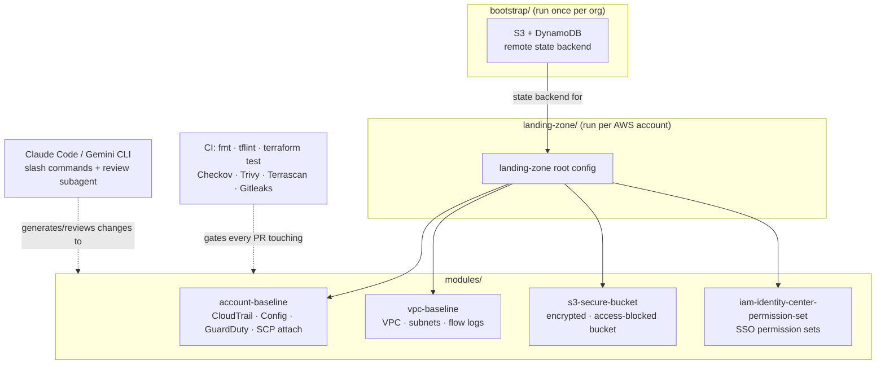

# ai-terraform-toolkit

[](https://github.com/DustyStudy/ai-terraform-toolkit/actions/workflows/ci.yml)
[](LICENSE)
[](https://www.terraform.io/)

AI-assisted Terraform toolkit for managing multi-account AWS organizations. Reusable,
security-hardened modules plus Claude Code / Gemini integration (context files, custom commands,
and a review subagent) so teams can provision and manage infrastructure safely without needing
deep Terraform expertise.

## Why this exists

Most teams adopting Terraform for a multi-account AWS org face the same problem: a small number
of people know Terraform well, and everyone else either avoids touching infrastructure or copies
existing code without fully understanding it. This repo tries to close that gap two ways:

1. **Opinionated, reusable modules** with security defaults baked in, so correct usage is the
   path of least resistance.
2. **AI assistant integration** (`CLAUDE.md`, `GEMINI.md`, custom commands, a review subagent) so
   someone can describe what they need in plain English and get code that already follows this
   repo's conventions — reviewed by CI and a second AI pass before it's ever applied.

## Architecture



`bootstrap/` runs once to stand up remote state; `landing-zone/` composes the four modules to
provision/configure one AWS account; every module change is gated by CI's scanning stack and can
be generated or reviewed through the Claude Code / Gemini integration described below.

## Repo structure

```
ai-terraform-toolkit/
├── CLAUDE.md                    # Context file read by Claude Code
├── GEMINI.md                    # Context file read by Gemini CLI / Code Assist
├── COMPLIANCE.md                # NIST 800-53 / FedRAMP control mapping
├── bootstrap/                    # One-time root config: creates the S3+DynamoDB state backend
├── modules/
│   ├── account-baseline/        # CloudTrail, Config, GuardDuty, SCP attachment for one account
│   │   └── tests/                # Native `terraform test` unit tests (mock_provider, no AWS creds)
│   ├── s3-secure-bucket/        # Encrypted, logged, access-blocked S3 bucket
│   │   └── tests/
│   ├── iam-identity-center-permission-set/  # Standardized SSO permission sets
│   │   └── tests/
│   └── vpc-baseline/            # VPC with public/private subnets, flow logs, no default SG rules
│       └── tests/
├── landing-zone/                # Root config: seed/configure a new AWS account using the modules
├── .claude/
│   ├── commands/                # Slash commands for common requests
│   └── agents/                  # tf-security-reviewer subagent
├── .pre-commit-config.yaml      # Local fmt/lint/security/docs checks, before you ever push
├── .terraform-docs.yml          # Config for auto-generated module Inputs/Outputs tables
├── .checkov.yaml                # Checkov scan configuration
├── .gitleaks.toml               # Gitleaks secret-scanning configuration
├── .tflint.hcl                  # tflint configuration (AWS ruleset)
└── .github/
    ├── dependabot.yml           # Weekly dependency-update PRs
    └── workflows/
        ├── ci.yml               # fmt, validate, tflint, docs check, Checkov, Trivy, Terrascan, Gitleaks, Infracost
        └── drift-detection.yml  # Scheduled plan vs. deployed infra, opens an issue on drift
```

## Getting started

1. Fork or clone this repo.
2. Install [pre-commit](https://pre-commit.com) and run `pre-commit install` — this catches
   fmt/lint/security/docs issues on your machine before you push. See "Local development" below.
3. Update `CLAUDE.md` / `GEMINI.md` with your org's naming convention, tagging requirements, and
   state backend details (see "Adopting this repo for your own org" in those files).
4. Run `bootstrap/` once to create the S3 + DynamoDB remote state backend — see
   `bootstrap/README.md`.
5. Set up OIDC federation between GitHub Actions and your AWS account(s) so CI can run
   `terraform plan` without long-lived credentials — needed for both the standard PR pipeline
   and (optionally) `drift-detection.yml`.
6. Open the repo in Claude Code or Gemini CLI and try one of the slash commands in
   `.claude/commands/`, e.g. `/new-s3-bucket`.

## Local development

Install pre-commit hooks once per clone so problems surface before you push, not after a CI run:

```bash
pip install pre-commit --break-system-packages   # or: brew install pre-commit
pre-commit install
```

From then on, every `git commit` runs `terraform fmt`, `terraform validate`, `tflint`, Checkov,
Gitleaks, and `terraform-docs` (regenerating the Inputs/Outputs tables in each module's README)
automatically. Run it against everything at once with `pre-commit run --all-files`.

## Requirements

- Terraform >= 1.7
- AWS provider >= 5.40
- An AWS Organization with IAM Identity Center enabled (for the permission-set module and
  landing zone)
- GitHub Actions (or adapt `ci.yml` to your CI system of choice)

## Security scanning

Every PR, every push to `main`, and a weekly scheduled run all execute:

- `terraform fmt -check` / `terraform validate`
- `tflint` with the AWS ruleset
- **Checkov** — broad IaC policy-as-code checks
- **Trivy** (config scan) — misconfigurations with CVE-aware severity
- **Terrascan** — additional policy-as-code coverage, cross-checking Checkov
- **Gitleaks** — secret scanning across the repo and git history

All scanner results are uploaded as SARIF to GitHub's **Security tab**, so findings are tracked
centrally instead of buried in workflow logs. See `.github/workflows/ci.yml`, `.checkov.yaml`,
`.tflint.hcl`, and `.gitleaks.toml` for configuration, and `COMPLIANCE.md` for how this maps to
NIST 800-53 / FedRAMP control families.

Found a vulnerability rather than a lint finding? See `SECURITY.md` for how to report it privately.

## Dependency management

[Dependabot](https://docs.github.com/en/code-security/dependabot) is configured
(`.github/dependabot.yml`) to open weekly PRs for:
- GitHub Actions used in `ci.yml` (keeps the scanning stack itself current)
- Terraform provider version constraints in each module and in `landing-zone/`

Enable it under the repo's Settings → Code security → Dependabot, if it isn't already active by
default for your account/org.

## Testing

Each module has a `tests/main.tftest.hcl` file using Terraform's built-in test framework
(`terraform test`, available since 1.7) with a full `mock_provider "aws" {}` — so the whole
suite runs offline, with no AWS credentials, network access, or real cloud resources involved.
CI's `terraform-test` job runs it on every PR.

Run it yourself from inside any module directory:

```bash
cd modules/s3-secure-bucket
terraform init -backend=false
terraform test
```

These tests check the module's *Terraform logic* — variable-driven conditionals, resource
counts, correct attribute wiring between resources, output correctness — not the semantic
content of generated IAM policy JSON (that's what Checkov/Trivy/Terrascan are for). If you add
a variable, a conditional resource, or an output, add or update the corresponding `run` block.

## Module documentation

Each module's Inputs/Outputs tables are generated by
[terraform-docs](https://terraform-docs.io), not hand-written — they live between
`<!-- BEGIN_TF_DOCS -->`/`<!-- END_TF_DOCS -->` markers in each `README.md`. Pre-commit
regenerates them automatically; CI's `terraform-docs-check` job fails the build if a README is
out of sync with the actual `variables.tf`/`outputs.tf`, so a stale table can't merge silently.

**Note:** the tables were verified against a real `terraform-docs` run in CI (the
`terraform-docs-check` job generates them for real and diffs against what's committed) — the
initial hand-written versions were caught and corrected by that exact mechanism on the first PR,
which is the workflow doing its job as intended.

## Cost estimates on PRs

The `infracost` CI job posts a cost-diff comment on every PR that touches `landing-zone/`,
showing the dollar impact of the change before anyone reviews it. It needs a free API key from
[infracost.io](https://www.infracost.io/) stored as the `INFRACOST_API_KEY` repo secret — without
it, the job skips itself rather than failing the build, so this is opt-in.

## Drift detection

`.github/workflows/drift-detection.yml` runs a scheduled, read-only `terraform plan` against the
deployed `landing-zone` and opens a GitHub issue (tagged `drift`) if deployed infrastructure has
diverged from what's in Git — e.g. a manual console change. Like the cost job, it's inert until
configured: it needs an `AWS_ROLE_ARN` secret and a few backend-config repo variables. See the
comment block at the top of that workflow file for the full setup checklist.

## Versioning

Module usage examples reference `?ref=v1.0.0` — tag releases (`git tag -a v1.0.0 -m "..."` then
`git push origin v1.0.0`) whenever a module's interface changes, and bump the ref in each module's
README to match. Consumers pulling from outside this repo should always pin a tag, not `main` —
see each module's "Usage" section for the relative-path alternative used by in-repo callers like
`landing-zone/`.

## License

MIT — see `LICENSE`.

## Contributing

Issues and PRs welcome. If you're adding a new module, please include a `README.md` inside the
module directory documenting inputs, outputs, and an example usage block, and make sure it passes
CI before opening the PR.
